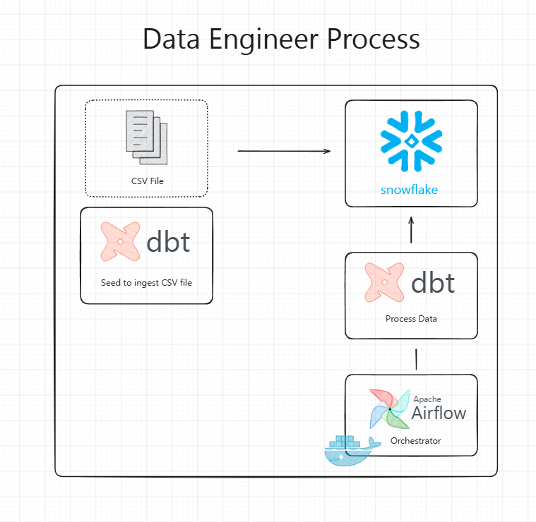
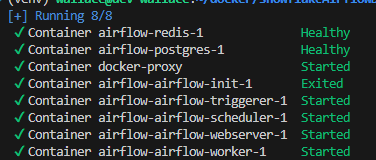
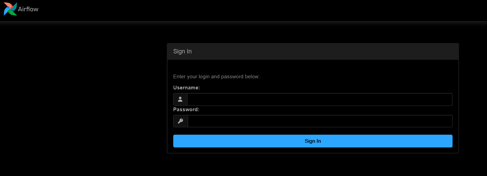
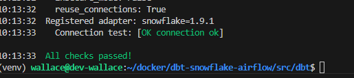
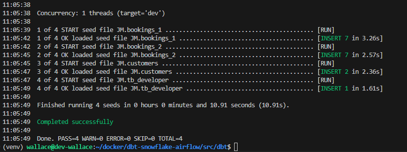
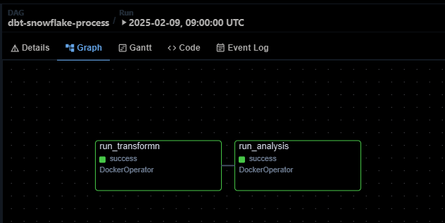
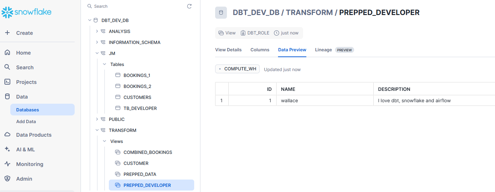

# Engenharia de Dados com Apache Airflow, Snowflake e dbt
Repositório do projeto "Engenharia de Dados com Apache Airflow, Snowflake e dbt". Este projeto é baseado no seguinte Guia Snowflake para engenharia de dados com Apache Airflow, Snowflake e dbt.

Vale ressaltar que esse repo foi criado usando como base o repo abaixo:

```
https://github.com/jacob-mennell/snowflakeAirflowDBT
```

## Vídeo tutorial

Link: https://youtu.be/mBrk5hvqc84

## Passo a passo contido neste repo:
Passo 1: Criar a conta no Snowflake 

Passo 2: Instalar o Docker

Passo 3: Conectar o dbt no Snowflake

Passo 4: Ingerir arquivo CSV no Snowflake com o dbt

Passo 5: Crie a imagem do dbt em um container

Passo 6: Orquestrar o container do dbt conectado ao Snowflake com o Airflow

## Siga as instruções abaixo para conseguir realizar todos os passos


## Arquitetura


## Introdução

### Snowflake

O Snowflake, uma plataforma de Data Cloud, fornece uma solução inovadora que simplifica pipelines de dados, permitindo que você foque mais em dados e análises do que na gestão de infraestrutura. Ele simplifica o armazenamento, processamento e computação quando comparado a soluções tradicionais.

### Airflow

O Apache Airflow é uma plataforma de gerenciamento de fluxo de trabalho de código aberto que permite criar e gerenciar pipelines de dados de forma eficiente usando grafos acíclicos direcionados (DAGs) de tarefas.

### Docker

O Docker é utilizado neste projeto para executar o Apache Airflow e, posteriormente, o dbt em um contêiner, tornando a configuração e a portabilidade mais fáceis.

### dbt

O dbt (data build tool) é uma ferramenta de linha de comando de código aberto que permite que analistas e engenheiros de dados transformem dados em seu data warehouse de forma mais eficiente. Ele segue uma abordagem modular e versionada para transformação de dados, permitindo que equipes construam, mantenham e documentem pipelines de dados de forma colaborativa.

dbt simplifica o processo de escrita de código SQL, organizando-o em modelos estruturados e gerenciando dependências. Ele ganhou popularidade em arquiteturas modernas de dados, especialmente quando integrado a plataformas em nuvem como Snowflake.

O dbt CLI é uma interface de linha de comando versátil que facilita a gestão de projetos dbt.

## Requisitos Prévios

O projeto requer os seguintes elementos:

* Docker

* Python >=3

* Uma conta Snowflake.

* Um usuário Snowflake com permissões necessárias, incluindo a capacidade de criar objetos no banco de dados DEMO_DB.

### Como instalar o Docker?
https://www.youtube.com/watch?v=pRFzDVn40rw&list=PLbPvnlmz6e_L_3Zw_fGtMcMY0eAOZnN-H

### Como criar um conta no Snowflake?
https://www.snowflake.com/en/emea/

### Como criar o user com permissões?
Entre na pasta ```scripts``` e use o arquivo ```snowflake-setup.sql``` como base.

### Como utilizar o projeto?
Faça clone com o comando:
```
git clone https://github.com/wlcamargo/dbt-snowflake-airflow.git
```
Entre na pasta do projeto
```
cd dbt-snowflake-airflow
```
Rode o container do Airflow com o comando:
```
cd airflow
docker compose up -d
```
Resultado esperado:




## Como acessar o Airflow?
Digite no navegador:
```
localhost:8081
```

---------------------------------------------

Exemplo Airflow UI:



---------------------------------------------

## Credenciais do Airlflow

username: airflow

password: airflow

---------------------------------------------

## Como instalar o dbt?
### Crie o ambiente virtual
```
python3 -m venv venv
```

### Ative o ambiente virtual (Linux)
```
source venv/bin/activate
```

### Ative o ambiente virtual (Windows)
```
venv/Scripts/Activate
```

### No ambiente virtual ativo instale as libs
```
pip install -r requirements.txt
```

## Como verificar se o dbt foi instalado?
```
dbt --version
```

Resultado esperado:


## Como configurar o dbt para conectar no Snowflake?
Entre na pasta ```src/dbt``` e altere o nome do arquivo ```example_profiles.yml``` para ```profiles.yml```

Altere o ```account: your-account``` para sua conta do Snowflake

Para verificar se a conexão está ok, use o comando:
```
cd src/dbt
dbt debug
```

Resultado esperado:



## Como ingerir dados no dbt?
Use o comando abaixo:
```
cd src/dbt
dbt seed
```

Resultado esperado:



## Como criar a imagem Docker do dbt?
```
cd src
docker build -t dbt-snowflake .
```

## Como entrar no container do dbt?
```
docker run -it dbt-snowflake /bin/bash
```

## Como orquestrar a dag do Airflow?
A Dag já está criada, basta fazer o disparo. Exemplo:



## Tabelas no Snowflake
Tabelas ingeridas a partir dos arquivos CSV


As tabelas processadas pelo dbt, foram materializadas como views, conforme exemplo:




## Conclusão
Se você chegou até aqui, parabéns! Já tens um projeto de exemplo para orquestrar o dbt conectado no Snowflake com o Airflow.


## 📚 Referências

- [Repo usado como base](https://github.com/jacob-mennell/snowflakeAirflowDBT)

- [Exploring dbt with Snowflake](https://www.entechlog.com/blog/kafka/exploring-dbt-with-snowflake/)

- [Snowflake Guide: Data Engineering with Apache Airflow](https://quickstarts.snowflake.com/guide/data_engineering_with_apache_airflow/index.html)


## Developer
| Desenvolvedor      | LinkedIn                                   | Email                        | Portfólio                              |
|--------------------|--------------------------------------------|------------------------------|----------------------------------------|
| Wallace Camargo    | [LinkedIn](https://www.linkedin.com/in/wallace-camargo-35b615171/) | wallacecpdg@gmail.com        | [Portfólio](https://wlcamargo.github.io/)   |
